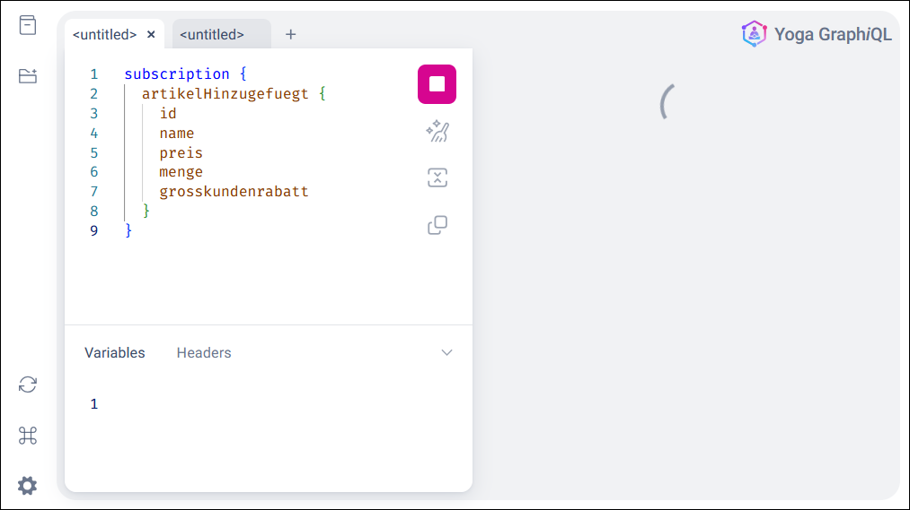

# GraphQL-API mit Nodejs für Produkte #

<br>

Dieses Repository enthält eine Nodejs-Anwendung mit Express.js und [graphql-yoga](https://www.npmjs.com/package/graphql-yoga), 
die eine GraphQL-API mit Artikeldaten bereitstellt.

<br>

----

## Beispiel-Queries ##

<br>

Die folgenden Queries können z.B. in *Yoga GraphiQL* (Web-UI) ausgeführt werden, die bei lokaler Ausführung
unter der folgenden URL erreichbar ist: http://localhost:8080/graphql

<br>


<br>

### Queries für Abfragen ###

Alle Artikel abfragen:

```
query {
  artikelAlle {
    id
    name
    beschreibung
    menge
    preis
    grosskundenrabatt
  }
}
```

<br>

Einzelnen Artikel anhand `ID` abfragen:

```
query {
  artikel( id: "2" ) {
    id
    name
    beschreibung
    menge
    preis
    grosskundenrabatt
  }
}
```

<br>

Artikel anhand Suchbegriff suchen:

```
query {
  artikelSuche( query: "monitor" ) {
    id
    name
    beschreibung
    preis
  }
}
```

<br>

### Änderungsoperationen ###

<br>

Neuen Artikel hinzufügen:

```
mutation {
  artikelHinzufuegen(
    name: "USB-C Netzteil 65W"
    beschreibung: "Kompaktes Schnelllade-Netzteil"
    menge: 25
    preis: 39.9
    grosskundenrabatt: false
  ) {
    id
    name
    beschreibung
    menge
    preis
    grosskundenrabatt
  }
}
```

<br>

Preis und Menge von Artikel ändern:
```
mutation {
  artikelAktualisieren(
    artikelId: "2"
    input: { preis: 899.99, menge: 8 }
  ) {
    id
    name
    preis
    menge
  }
}
```

<br>

Datensatz löschen:
```
mutation {
  artikelLoeschen(
    artikelId: "2"
  ) {
    id
    name
    preis
    menge
  }
}
```  

<br>

## Änderungen abonnieren ##

<br>

Mit GraphQL kann auch eine "Subscription" (Abonnement) definiert werden, so dass wir sofort über bestimmte Datenänderungen informiert werden.

<br>



<br>


```
subscription {
  artikelGeaendert {
    art
    felder
    artikel {
      id
      name
    }
  }
}
```


<br>

----

## License ##

<br>

See the [LICENSE file](LICENSE.md) for license rights and limitations (BSD 3-Clause License)
for the files in this repository.

<br>

