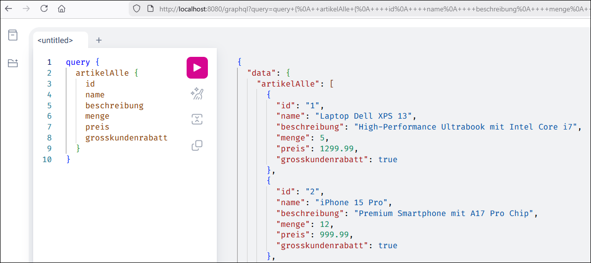

# GraphQL-API mit Nodejs für Produkte #

<br>

Dieses Repository enthält eine Nodejs-Anwendung mit Express.js und [graphql-yoga](https://www.npmjs.com/package/graphql-yoga), 
die eine GraphQL-API mit Artikeldaten bereitstellt.

<br>

----

## Beispiel-Queries ##

<br>

Die folgenden Queries können z.B. in *Yoga GraphiQL* (Web-UI) ausgeführt werden, die bei lokaler Ausführung
unter der folgenden URL erreichbar ist: http://localhost:8080/graphql

<br>



<br>

Alle Artikel abfragen:

```
query {
  artikelAlle {
    id
    name
    beschreibung
    menge
    preis
    grosskundenrabatt
  }
}
```

<br>

Einzelnen Artikel anhand `ID` abfragen:

```
query {
  artikel( id: "2" ) {
    id
    name
    beschreibung
    menge
    preis
    grosskundenrabatt
  }
}
```

<br>

Artikel anhand Suchbegriff suchen:

```
query {
  artikelSuche( query: "monitor" ) {
    id
    name
    preis
  }
}
```

<br>

Neuen Artikel hinzufügen:

```
mutation {
  artikelHinzufuegen(
    name: "MacBook Air 15"
    beschreibung: "M3, 16GB, 512GB"
    menge: 7
    preis: 1999.0
    grosskundenrabatt: true
  ) {
    id
    name
    preis
    grosskundenrabatt
  }
}
```

<br>

Menge für einen Artikel aktualisiert:

```
mutation {
  mengeAktualisieren(artikelId: "3", menge: 42) {
    id
    name
    menge
  }
}
```

<br>

Preis für einen Artikel aktualisiert:

```
mutation {
  preisAktualisieren(artikelId: "4", preis: 349.99) {
    id
    name
    preis
  }
}
```

<br>

Artikel anhand ID löschen:

```
mutation {
  artikelLoeschen(artikelId: "2") {
    id
    name
    preis
  }
}
```

<br>

----

## License ##

<br>

See the [LICENSE file](LICENSE.md) for license rights and limitations (BSD 3-Clause License)
for the files in this repository.

<br>
